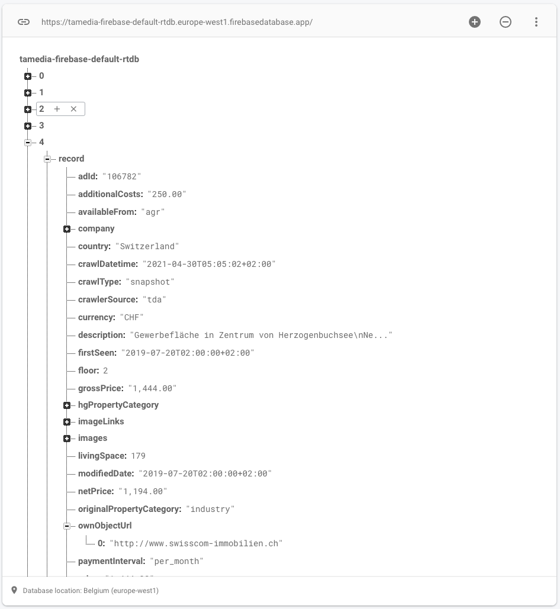

# Analysis
## Pre-Analysis
In order to browse and analyse quickly the data, I transformed the JSON-lines input files into fully valid JSON files. As JSON lines
are not valid JSON, I created an array of JSON objects:
```
[{},{},{},...,{}]
```
With the valid JSON files, I was able to upload the files to Google Firebase creating a Realtime Database. To keep the
Google Firebase free of charge, I uploaded not the full content.



## Technical Organisation
### Docker
To work quickly with the right tools, I fired up two [Docker](stack.yml) containers to work with PHP and MySQL.
### PHP & MySQL
* Step 1: Transform JSON-lines files to MySQL inserts ([PHP](importer.php))
* Step 2: [Create](./create.sql) the database and import the MySQL insert files ([Flatfox](./ff-2021-04-30.sql), [Immoscout](./is24-2021-04-30.sql))
```
mysql -uroot -p tamedia < /var/lib/mysql/ff-2021-04-30.sql
mysql -uroot -p tamedia < /var/lib/mysql/is24-2021-04-30.sql
  ```
For convenience reasons, I created a full dump of the available data.
```
mysqldump -uroot -p tamedia "tamedia_listings" --result-file="/var/lib/mysql/dump.sql" --skip-add-locks --skip-disable-keys
```